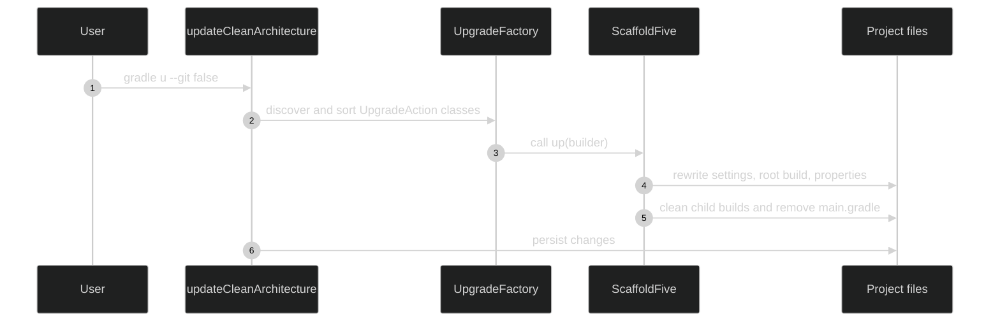
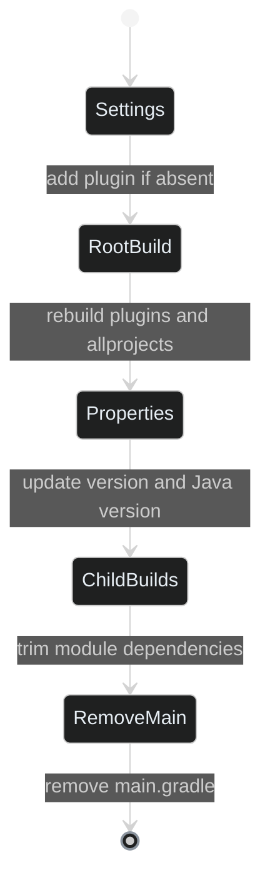

# Migration v4 to v5

This migration converts a project generated with scaffold-clean-architecture **4.7.3** to the
5.x Gradle layout. Run the task from the project root. The `u` shortcut invokes
`updateCleanArchitecture`; `--git false` disables only the pending-changes check, so commit or
back up the project before running it. ([Update Project task](https://bancolombia.github.io/scaffold-clean-architecture/docs/tasks/update-project))

```shell
gradle u --git false
```

:::warning
You must update to scaffold version 4.7.3 before running this migration, which is required for it to work correctly.
:::

## What changes

| File | Result |
| --- | --- |
| `settings.gradle` | Adds the `co.com.bancolombia.cleanArchitecture.settings` plugin at the selected version when that plugin ID is absent and `pluginManagement` exists. Preserves `pluginManagement` and `rootProject.name`. |
| Root `build.gradle` | Replaces the old file with the v5 plugins block and reconstructed `allprojects` configuration. Carries forward repositories and the AWS SDK BOM found in `main.gradle`, plus non-default Sonar exclusions. |
| `gradle.properties` | Replaces `systemProp.version` when that property exists. Adds `javaVersion` only when absent, using the old main build's Java toolchain version or `17` as a fallback. |
| Child Gradle files | Removes dependencies now supplied by the v5 conventions and trims the app-service and infrastructure dependency blocks as described below. |
| `main.gradle` | Removed after its repositories, AWS BOM, and Java toolchain information have been read. |

The generated v5 settings template also places the settings plugin in `settings.gradle` and retains
the project name; the migration follows that layout. ([settings.gradle.mustache](https://github.com/bancolombia/scaffold-clean-architecture/blob/feature/next/src/main/resources/structure/root/settings.gradle.mustache#L1-L14))


<!-- Sources: src/main/java/co/com/bancolombia/task/UpdateProjectTask.java:45-61; src/main/java/co/com/bancolombia/factory/upgrades/UpgradeFactory.java:21-30; supplied UpgradeY2026M11D07ScaffoldFive implementation -->

### Child module cleanup

The task supplies the migration with the Gradle files found in the project. Settings files are
excluded from that list, and the migration separately handles the root build and `main.gradle`.
([UpdateProjectTask.java](https://github.com/bancolombia/scaffold-clean-architecture/blob/feature/next/src/main/java/co/com/bancolombia/task/UpdateProjectTask.java#L57-L60),
[Utils.java](https://github.com/bancolombia/scaffold-clean-architecture/blob/feature/next/src/main/java/co/com/bancolombia/utils/Utils.java#L143-L162))

| Module type | Dependency cleanup |
| --- | --- |
| `applications/app-service` | Removes every `project(':module')` dependency and retains only its `dependencies` block. |
| Infrastructure modules | Removes `project(':model')` and `project(':usecase')` dependencies, while preserving dependencies on other infrastructure modules. |
| Other child modules | Keeps project dependencies. |
| All processed child modules | Removes `org.springframework:spring-context`, ArchUnit, and `tools.jackson.core:jackson-databind` test dependencies. |


<!-- Sources: supplied UpgradeY2026M11D07ScaffoldFive implementation -->

When no explicit dependency list is passed to `u`, the task also scans Gradle files for declared
dependencies and attempts to update them to their latest versions. This is part of the normal
update task, not a separate step in the v4-to-v5 migration. ([UpdateDependencies.java](https://github.com/bancolombia/scaffold-clean-architecture/blob/feature/next/src/main/java/co/com/bancolombia/factory/upgrades/actions/UpdateDependencies.java#L30-L45))

## Review before accepting

Some blocks may be removed, or be unnecessary after the migration. Carefully review the changes to ensure that all required configurations and dependencies are preserved.

Special properties located at `build.gradle`

:::warning
If you have versions for your dependencies, declare them here you need to restore them after the migration. Because this block will be removed to ensure that you only keep necessary versions.
:::

```gradle
buildscript {
    ext {
        reactiveCommonsVersion = '5.4.0'
        jsonVersion = '2.5.2'
        validationLibVersion = '3.1.1'
        jacksonVersion = '2.21.1'
        jacksonAnnotationsVersion = '2.21'
        log4jVersion = '2.25.4'
        //... others
    }
}
```

The migration reconstructs the root `build.gradle`; it does not preserve arbitrary statements from
the old file. It only carries forward the repositories and AWS BOM it recognizes in `main.gradle`,
and Sonar exclusions that are not one of its known defaults. Review any custom plugins, tasks,
repositories, or configuration before accepting the generated file.

If `settings.gradle` already contains the settings plugin ID, this action leaves that file unchanged,
including its existing plugin version. Otherwise, if `pluginManagement` exists, it rebuilds the file
from that block, the selected plugin declaration, and `rootProject.name`. If `pluginManagement` is
absent, the action leaves the file unchanged. Review custom includes or other settings statements
because they are not copied by this transformation.

After the task completes, inspect the diff and run the checks appropriate for the project, for
example:

```shell
git diff --check
./gradlew build
```

The migration action uses the old `main.gradle` as input before removing it. If that file is absent,
the Java version defaults to `17`, and repositories or the AWS BOM cannot be carried forward from
it.

